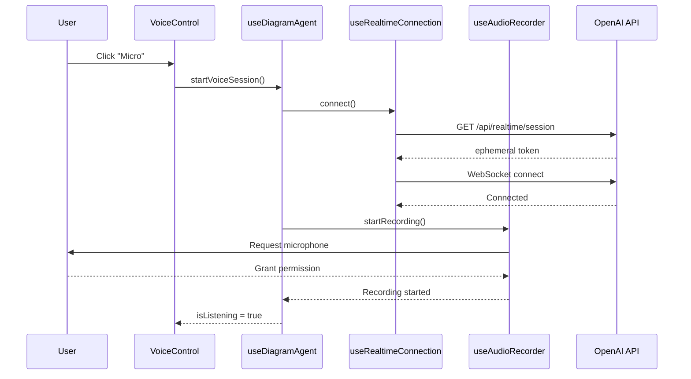
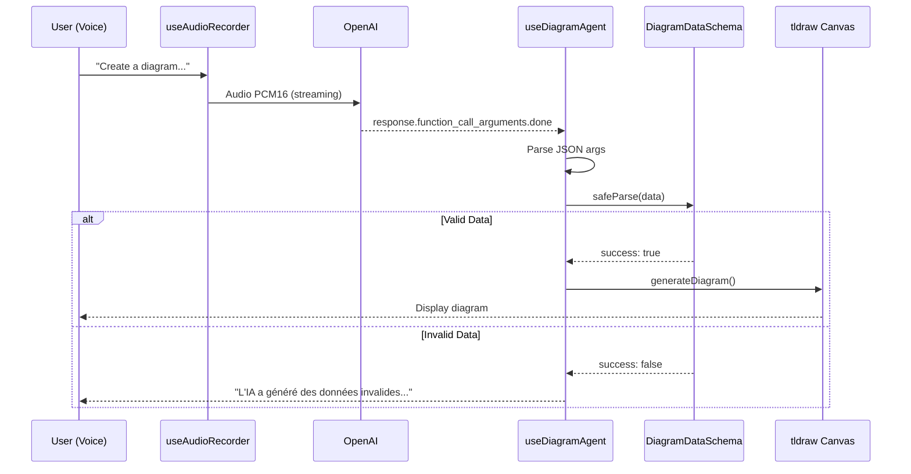

# 🏗️ Architecture Technique - Draw by Voice

## Vue d'Ensemble

Draw by Voice utilise une **architecture en couches** pour séparer les responsabilités et faciliter la maintenance.

```
┌─────────────────────────────────────────────────────┐
│                  User Interface                      │
│              (VoiceControl.tsx)                      │
└────────────────────┬────────────────────────────────┘
                     │
┌────────────────────▼────────────────────────────────┐
│            Business Logic Layer                      │
│           (useDiagramAgent.ts)                       │
│  • Orchestration                                     │
│  • Validation Zod                                    │
│  • Génération diagrammes                             │
└──┬─────────────────────┬──────────────────┬─────────┘
   │                     │                  │
   │                     │                  │
┌──▼──────────┐  ┌──────▼─────────┐  ┌────▼────────┐
│ Connection  │  │ Audio Recorder │  │ Audio Player│
│   Layer     │  │                │  │             │
│ (WebSocket) │  │ (Microphone)   │  │ (Speaker)   │
└──┬──────────┘  └────────────────┘  └─────────────┘
   │
   │
┌──▼──────────────────────────────────────────────────┐
│           OpenAI Realtime API                        │
│              (WebSocket)                             │
└─────────────────────────────────────────────────────┘
```

---

## Couches de l'Application

### 1. User Interface Layer

**Fichiers** :
- `components/VoiceControl.tsx`
- `app/page.tsx`

**Responsabilités** :
- Affichage UI (boutons, états, erreurs)
- Gestion des interactions utilisateur
- Rendu du canvas tldraw

**Communication** : Uniquement via le hook `useDiagramAgent`

---

### 2. Business Logic Layer

**Fichier** : `hooks/useDiagramAgent.ts`

**Responsabilités** :
- Orchestration des couches inférieures
- Parser les messages OpenAI
- **Validation Zod** des données
- Génération des diagrammes sur canvas
- Gestion des erreurs métier

**Pattern** : **Facade Pattern**
```typescript
export function useDiagramAgent({ editor, onDiagramGenerated }) {
    const connection = useRealtimeConnection()
    const audioRecorder = useAudioRecorder()
    const audioPlayer = useAudioPlayer()
    
    // Logique d'orchestration...
}
```

---

### 3. Connection Layer

**Fichier** : `hooks/useRealtimeConnection.ts`

**Responsabilités** :
- Gestion du cycle de vie WebSocket
- Authentification avec token ephemeral
- Pattern **Publisher/Subscriber** pour les messages
- Gestion des erreurs de connexion

**États** :
```typescript
interface RealtimeConnectionState {
    isConnected: boolean
    isConnecting: boolean
    error: string | null
}
```

**API Publique** :
```typescript
{
    state: RealtimeConnectionState
    connect: () => Promise<void>
    disconnect: () => void
    sendMessage: (message: object) => void
    onMessage: (handler: (msg: unknown) => void) => () => void
}
```

---

### 4. Audio Layer

#### 4.1 Audio Recorder

**Fichier** : `hooks/useAudioRecorder.ts`

**Responsabilités** :
- Accès microphone (getUserMedia)
- Capturer audio temps réel
- **Conversion Float32 → PCM16 → Base64**
- Streaming vers WebSocket

**Pipeline Audio** :
```
Microphone → AudioContext (24kHz) → ScriptProcessorNode
    → Float32Array → Int16Array (PCM16) → Base64 → WebSocket
```

#### 4.2 Audio Player

**Fichier** : `hooks/useAudioPlayer.ts`

**Responsabilités** :
- Décoder audio de l'IA
- **Conversion Base64 → PCM16 → Float32**
- Lecture via AudioContext
- File d'attente (streaming)

**Pipeline Audio** :
```
WebSocket → Base64 → Int16Array (PCM16) → Float32Array
    → AudioBuffer → AudioContext → Speakers
```

---

## Flux de Données

### 1. Session Vocale - Démarrage



### 2. Génération de Diagramme



---

## Validation des Données

### Schémas Zod

**Fichier** : `lib/schemas.ts`

```typescript
// Type de nœud
export const NodeTypeSchema = z.enum([
    'user', 'server', 'database', 'decision', 'step'
])

// Nœud complet
export const DiagramNodeSchema = z.object({
    id: z.string().min(1),
    label: z.string().min(1),
    type: NodeTypeSchema,
})

// Arête
export const DiagramEdgeSchema = z.object({
    source: z.string().min(1),
    target: z.string().min(1),
    label: z.string().optional(),
})

// Diagramme complet
export const DiagramDataSchema = z.object({
    nodes: z.array(DiagramNodeSchema).min(1),
    edges: z.array(DiagramEdgeSchema),
    explanation: z.string().min(1),
})
```

### Point de Validation

**`hooks/useDiagramAgent.ts`** (ligne ~107) :
```typescript
const validationResult = DiagramDataSchema.safeParse(args.diagram_data)

if (!validationResult.success) {
    console.error('❌ Invalid data:', validationResult.error.format())
    setError("L'IA a généré des données invalides...")
    return // Empêche le crash
}
```

---

## Gestion des Erreurs

### Stratégie en Couches

| Couche | Type d'Erreur | Gestion |
|--------|---------------|---------|
| **Connection** | WebSocket, Réseau | Message utilisateur + retry possible |
| **Audio Recorder** | Microphone, Permissions | Prompt permissions + message clair |
| **Audio Player** | Décodage, Lecture | Log console (non-bloquant) |
| **Business Logic** | Validation Zod, Parsing | Message convivial + prevention crash |

### Messages Conviviaux

❌ **Avant** :
```
Error: Invalid diagram data: Expected object, received string at diagram_data.nodes[0]
```

✅ **Après** :
```
L'IA a généré des données invalides. Réessayez avec une description plus claire.
```

---

## Performance & Optimisations

### React Hooks

Toutes les fonctions sont **memoized** pour éviter les re-renders inutiles :

```typescript
// ✅ useCallback pour fonctions
const handleMessage = useCallback((msg) => {
    // ...
}, [dependencies])

// ✅ useMemo pour objets complexes
const sessionConfig = useMemo(() => ({
    modalities: ['text', 'audio'],
    // ...
}), [])

// ✅ useMemo pour états agrégés
const aggregatedState = useMemo(() => ({
    isActive: connection.state.isConnected,
    isListening: audioRecorder.isRecording,
    // ...
}), [connection.state, audioRecorder.isRecording])
```

**Impact** : tldraw canvas reste fluide à 60fps même pendant l'enregistrement audio.

### Cleanup

**Pattern** : Cleanup automatique dans `useEffect` avec tableau de dépendances vide :

```typescript
useEffect(() => {
    return () => {
        // Cleanup direct sans boucle infinie
        audioRecorder.stopRecording()
        connection.disconnect()
        audioPlayer.cleanup()
    }
    // eslint-disable-next-line react-hooks/exhaustive-deps
}, [])
```

---

## Sécurité

### 1. Protection de la Clé API

**Route API** (`app/api/realtime/session/route.ts`) :
```typescript
export async function GET() {
    // ✅ Variable serveur uniquement
    const apiKey = process.env.OPENAI_API_KEY
    
    if (!apiKey) {
        console.error('❌ OPENAI_API_KEY not configured')
        return Response.json({ error: 'Server configuration error' }, { status: 500 })
    }
    
    // Créer session ephemeral
    const response = await fetch('https://api.openai.com/v1/realtime/sessions', {
        headers: { 'Authorization': `Bearer ${apiKey}` }
    })
    
    return Response.json({ client_secret: data.client_secret })
}
```

**Client** : Reçoit uniquement le token ephemeral temporaire, **jamais la clé API**.

### 2. Validation Runtime

**Principe** : Ne jamais faire confiance aux données externes (même de l'IA).

```typescript
// Toujours valider avec Zod avant utilisation
const result = DiagramDataSchema.safeParse(externalData)
if (!result.success) {
    // Rejeter les données invalides
    return
}
const validData = result.data // Type-safe ✅
```

---

## Déploiement

### Variables d'Environnement

**Production** :
```bash
OPENAI_API_KEY=sk-proj-...
NODE_ENV=production
```

**Important** : 
- ✅ Utiliser un **secret manager** (Vercel Secrets, AWS Secrets Manager, etc.)
- ❌ Ne jamais commit `.env.local` dans Git

### Build

```bash
npm run build
# Output: .next/ directory

npm run start
# Serveur production sur port 3000
```

---

## Debugging

### Logs de Développement

Tous les logs sont conditionnels :
```typescript
if (process.env.NODE_ENV === 'development') {
    console.log('🔑 Requesting session...')
    console.log('✅ Connected to OpenAI')
    console.log('🎤 Recording started')
}
```

**Production** : Aucun log console → Performance optimale.

### DevTools

**Chrome DevTools > Performance** :
- Enregistrer une session
- Vérifier FPS (doit rester ~60fps)
- Chercher les "Long Tasks" (>50ms)

**React DevTools > Profiler** :
- Identifier les composants qui re-render
- Vérifier l'efficacité des `useCallback` / `useMemo`

---

## Évolution Future

### Extensibilité

L'architecture en couches permet d'ajouter facilement :

- **Nouveaux types de nœuds** : Modifier `schemas.ts` + `nodeTypeMapping.ts`
- **Nouvelles IA** : Implémenter un nouveau `useRealtimeConnection` pour GPT-4o, Claude, etc.
- **Export** : Ajouter un hook `useExporter` (PDF, PowerPoint, Mermaid)
- **Collaboration** : WebRTC ou WebSocket multi-utilisateurs

### Tests

Structure actuelle facilite les tests unitaires :

```typescript
// Tester la couche connection isolément
describe('useRealtimeConnection', () => {
    it('should connect to WebSocket', async () => {
        const { result } = renderHook(() => useRealtimeConnection())
        await act(() => result.current.connect())
        expect(result.current.state.isConnected).toBe(true)
    })
})
```

---

<p align="center">
  <strong>Architecture robuste = Code maintenable</strong>
</p>
